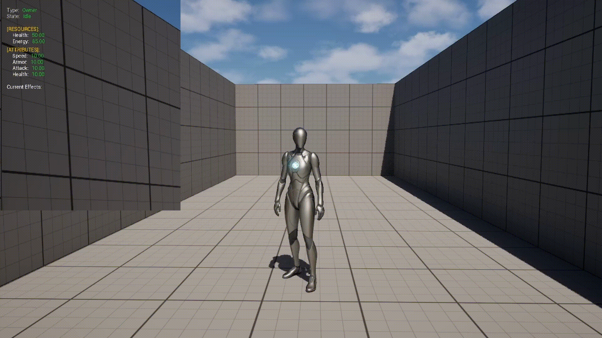
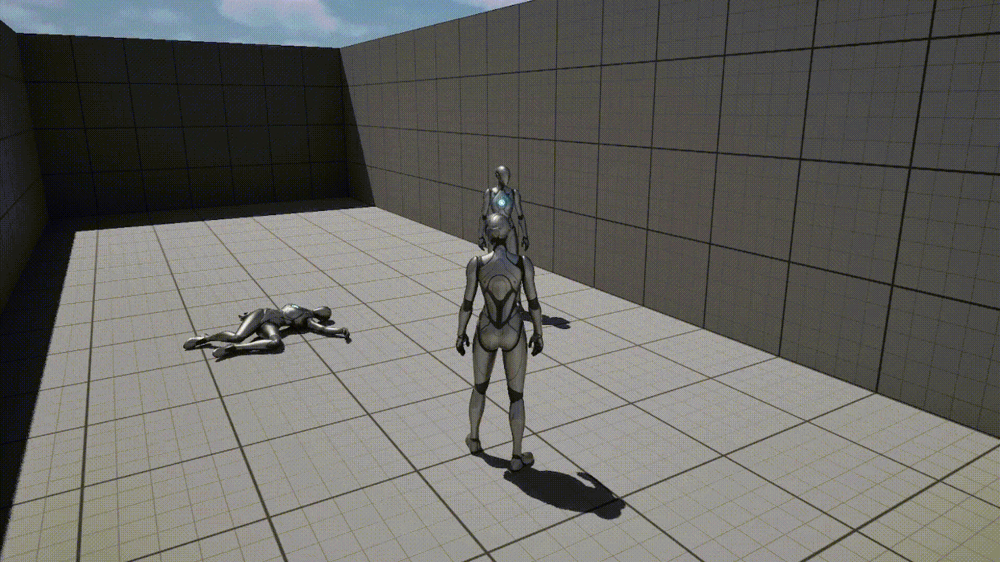
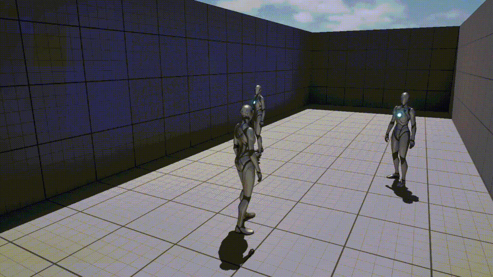
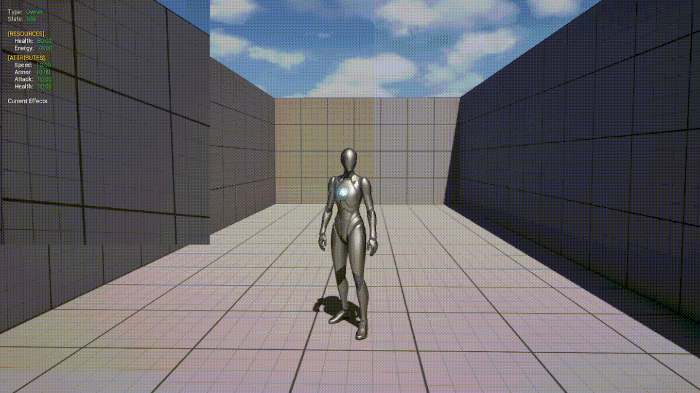
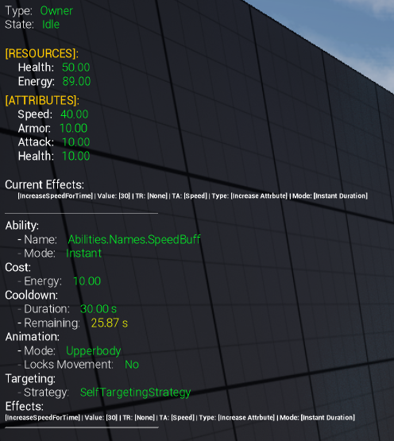
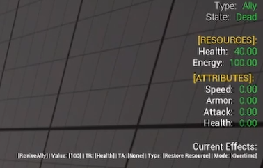
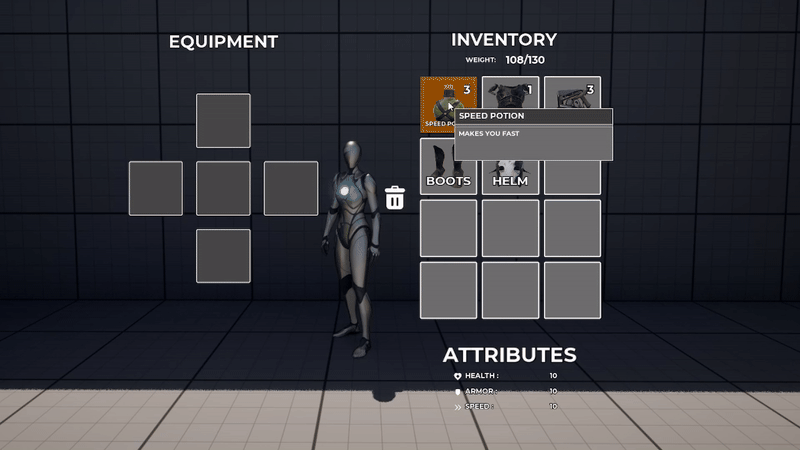
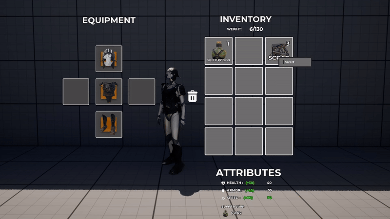
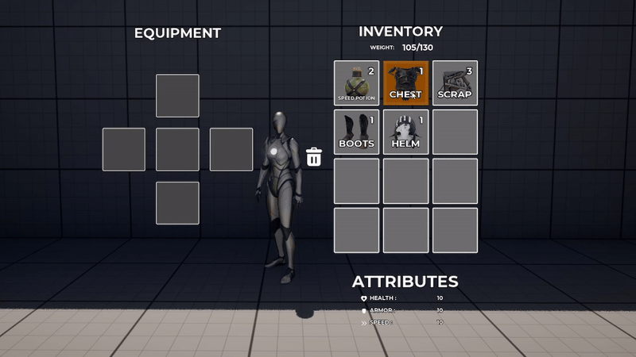
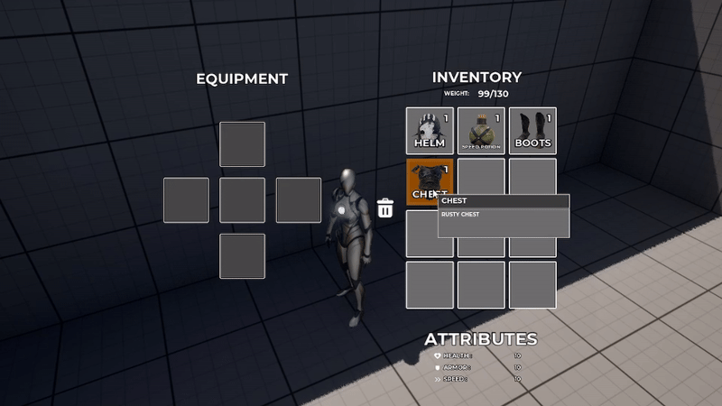

# Gameplay Systems


## Table of Contents
- [Ability System](#ability-system-unreal-engine-c)
- [Character & Combat Core](#character--combat-core-unreal-engine-c)
- [Inventory & Equipment System](#inventory--equipment-system-unreal-engine-c)
- [Save & Persistance System](#save-system--persistance-unreal-engine-c)
- [Interaction System](#interaction-system-unreal-engine-c)
- [Pacman](#pacman-unreal-engine-c)

---

---

---

# Ability System (Unreal Engine C++)

A lightweight, modular **Ability + Effects framework** built in Unreal Engine C++, designed around **clear ownership**, **data-driven definitions**, and **event-driven execution**.  
Instead of using GAS, this system focuses on readable gameplay architecture: **abilities are defined as assets**, executed through a central component, and resolved via **targeting strategies** and **runtime effect instances**.

---

<p align="center">
  
  
  
</p>

<p align="center">
  
  
</p>


## Core Architecture

- **`UAbilitySystemComponent`** is the gameplay authority:
  - owns granted abilities
  - validates activation (resources, cooldowns, targeting)
  - commits costs
  - executes effects and broadcasts gameplay events
- **Abilities are data-driven** using `UAbilityData` (`UPrimaryDataAsset`):
  - gameplay tag identity
  - cast mode / cast time
  - cooldown + energy cost
  - targeting strategy + indicator data
  - list of effect classes to execute
- **Targeting is strategy-based** (`UTargetingStrategy`):
  - interchangeable targeting implementations (self, forward aim, direct aim, manual AOE)
  - optional per-frame targeting updates (ticks only while targeting)
  - returns `FAbilityTargetData` used by effects
- **Execution uses runtime instances**, not one-off calls:
  - `UActiveAbilityInstance` tracks casting and supports aborting
  - `UActiveEffectInstance` manages timed and overtime effects

---

## Ability Flow

1. **TryUseAbility**
2. **Validate**
   - resource check via `IResourceInterface`
   - cooldown check (tracked per ability asset)
   - targeting resolution (strategy state machine)
3. **Commit**
   - consume energy cost
4. **Execute**
   - create `UActiveAbilityInstance` (cast lifecycle)
   - apply each `UAbilityEffect` to resolved targets
   - track cooldown and broadcast events
   - refund cost and fail if nothing successfully applied

---

## Effects System

- **`UEffectsComponent`** owns all active effects on the character:
  - stores `UActiveEffectInstance` objects
  - supports duration and overtime ticks
  - supports external cancel (ability aborted)
  - broadcasts UI/VFX events
- **Effects are instance-driven**:
  - `UActiveEffectInstance` applies and reverts attribute/resource deltas
  - uses timers for duration and overtime ticks
  - removes itself cleanly and notifies the owner component
- Supports **cross-actor ownership**:
  - if an effect originates from another actor, the receiver listens for ability abort and cleans up correctly

---

## Debug & Development Tools
<p align="left" style="margin-bottom: 100px;">
  
  
</p>

<p align="left">
  <em>Player (Owner) (left), Target (Enemy/Ally) (Right).</em>
</p>

Built-in gameplay debug HUD showing:

- entity state
- resources
- attributes
- active abilities
- active effects

Debug data is provided through **structured snapshot objects**, not direct widget queries.

This allows quick verification of gameplay state during:

- ability casts
- damage events
- effect application
---
## Example Implementations

- **Projectile Effect**  
  Spawns a projectile actor and initializes it with targeting payload.

- **Area Effect**  
  Spawns an area occurrence actor and applies nested on-hit effects.

- **Manual AOE Targeting**  
  Real-time indicator placement driven by camera traces and range clamping.

---

## Design Principles

- **Ownership first**: gameplay state lives in components, UI/VFX respond via delegates
- **Data over hardcode**: ability behavior defined through assets and effect classes
- **Composable execution**: abilities run modular effect blocks
- **No GAS dependency**: architecture stays understandable and debuggable while still scalable

---

## What I Learned

- How to structure a custom ability framework using **asset-defined abilities** and runtime **instance objects** for clean lifecycle control.
- How to design targeting as a **pluggable strategy system**, including tick-driven targeting modes.
- How to keep abilities **data-driven**, while still allowing complex behavior through composable effect classes (projectile, AOE, nested on-hit effects).
- How to model timed gameplay logic using **timers and explicit state**, including cast windows, abort logic, and overtime effects.
- How to build clean gameplay/UI boundaries by using **delegates as the contract** between systems and presentation layers.


---

---

---

# Save System & Persistance (Unreal Engine C++)

A modular, component-driven save system built in Unreal Engine, designed around clear ownership, binary serialization, and subsystem-based orchestration.

Instead of relying on a monolithic save structure, each gameplay component owns its own persistence logic, while a central subsystem handles disk I/O and state application.

* * *

## Overview

Traditional save systems often store all gameplay data inside a single, growing save struct.  
This quickly becomes difficult to maintain as new systems are added.

This project uses a **component-driven persistence model**:

- Each gameplay component is responsible for saving and loading its own data.
- The save system only coordinates discovery and storage.
- No direct dependencies exist between gameplay systems.

This keeps the architecture modular, scalable, and production-friendly.

* * *

### Responsibility Breakdown

- **Components**
  - Own their save data.
  - Serialize and deserialize themselves.

- **ISavableInterface**
  - Defines a common persistence contract.

- **GameSaveSubsystem**
  - Handles save/load orchestration.
  - Performs disk I/O.
  - Applies loaded state.

- **SaveGame Object**
  - Stores binary data for all components.

* * *

## Core Systems

### Savable Interface

All saveable components implement: **ISavableInterface**

**Required Functions:**

  - FName GetSaveID();
  - void SerializeToBinary(TArray<uint8>& OutData);
  - void DeserializeFromBinary(const TArray<uint8>& InData);

**Purpose:**

  - Standard save contract.

  - No hard references between systems.

  - Plug-and-play save support.

### Save Subsystem

Acts as the single authority for persistence.

**Responsibilities:**

  - Saving to disk

  - Loading from disk

  - Storing pending load data

  - Applying saved data to components


**Save Data Structure:**
```
USaveGameObject
    FGameSaveData
        FPlayerSaveData
            TMap<FName, FComponentBinaryData>
```

**Save Flow**

```
PlayerController requests save
        ↓
SaveSubsystem::SaveGame()
        ↓
Find savable components on:
    - Pawn
    - PlayerState
        ↓
For each component:
    GetSaveID()
    SerializeToBinary()
    Store in map
        ↓
Write to disk
```

**Load Flow (Two-Phase System)**
To avoid initialization order issues, loading is split into two phases.

Phase 1 — Disk Load
```
LoadGame()
    → read save file
    → store PendingLoadData
    → set bIsLoadPending = true
```
Phase 2 — State Application
```
Character BeginPlay
    → ApplyPendingLoad()
    → components restore themselves
```

This ensures all gameplay systems are fully initialized before state is applied.

* * *

### Key Design Decisions
Component-Driven Persistence

  - New systems without modifying core save structs.

  - Independent serialization logic per component.

  - Reduced coupling between gameplay features.

### Current Feature Set

**Core Features**

  - Component-based persistence

  - Interface-driven save contract

  - Binary serialization per component

  - Subsystem-controlled disk I/O

  - Two-phase load pipeline

  - Pawn + PlayerState coverage

**Qualities**

  - Decoupled gameplay systems

  - Clear data ownership

  - Easily extensible

  - Production-style structure

Future systems can be added without redesign.

### What I Learned

  - How to use Unreal subsystems as global gameplay services.

  - How to avoid initialization order bugs using a two-phase load pipeline.

  - How to use binary serialization for flexible, decoupled save data.

---

---

---

## Character & Combat Core (Unreal Engine C++)

The project uses a modular, component-driven character architecture where all gameplay behavior is handled through dedicated systems instead of monolithic character classes.


<p align="center">
  
  
</p>


### Core Character Structure

Each character is built around a `BaseCharacter` class that owns independent gameplay components:

- **ResourceComponent**  
  Handles health and energy with event-driven updates.

- **AttributesComponent**  
  Stores base and bonus attributes (attack, armor, speed, etc.).  
  Supports modifiers from equipment and effects.

- **EffectsComponent**  
  Manages active gameplay effects:
  - instant effects
  - duration-based effects
  - overtime effects
  - stackable and non-stackable logic
  - automatic revert on failure or expiration

- **AbilitySystemComponent**  
  Responsible for:
  - ability validation (energy, cooldown, targeting)
  - cast state handling
  - effect execution
  - cooldown tracking

- **CharacterMoverComponent**  
  Handles movement overrides and speed modifiers.

- **CharacterAnimationComponent**  
  Plays animations driven by gameplay events.

- **CharacterVFXComponent**  
  Spawns and manages visual effects tied to abilities and status effects.

---

### Event-Driven Gameplay Flow

Systems communicate through delegates instead of direct coupling.

**Example ability flow:**

1. Input or AI requests ability use.
2. AbilitySystem validates:
   - energy cost
   - cooldown
   - targeting
3. Ability enters cast state.
4. On cast completion:
   - effects are applied to targets
   - cooldown is started
   - animations and VFX are triggered
5. Effects modify:
   - resources
   - attributes
6. Effects expire or are aborted automatically.

---

### Shared Player & Enemy Logic

Both player and enemy characters use the same systems:

- `AbilitySystemComponent`
- `EffectsComponent`
- `AttributesComponent`
- `ResourceComponent`

The enemy uses a simple `EnemyAIComponent` that:

- detects targets using a trigger sphere
- switches between idle and attacking states
- uses the same ability pipeline as the player

This ensures:

- no duplicated combat logic
- consistent behavior between AI and player
- easier extension for new enemy types

---

### Character States

Characters operate on a simple gameplay state model:

- Idle
- Casting
- Attacking
- Dead

State changes are driven by:

- ability casting
- movement logic
- death/resurrection events

### What I Learned

- **Component-driven architecture**  
  Splitting character logic into independent components (abilities, effects, attributes, resources, movement, animation) makes systems easier to extend and reuse across player and AI characters.

- **Shared player and AI pipelines**  
  Both player and enemy characters use the same ability and effect systems, preventing duplicated combat logic.

- **Debug-first development**  
  Building a structured gameplay debug HUD helped quickly verify state transitions, effect stacking, resource changes, and ability execution during development.


---

---

---


# Inventory & Equipment System (Unreal Engine C++)


<p align="center">
  
  

</p>

<p align="center">
    
  

</p>


Gameplay logic lives entirely in **Actor Components**, while the UI layer acts as a **reactive client** that never mutates gameplay state directly.

---

## Key Design Highlights

- **InventoryComponent** acts as the single source of truth for item storage, stacking, weight limits, and consumption logic.
- **EquipmentComponent** owns equipped items, validates equipment rules, and applies visual and gameplay effects.
- Inventory ↔ Equipment interaction is handled through **explicit APIs and delegates**, avoiding circular dependencies.
- Items are **data-driven via DataTables**, supporting stack sizes, equip types, consumables, visuals, and attributes.
- World items use a shared **Interactable system**, keeping pickup logic decoupled from inventory internals.
- Complex interactions (drag & drop, splitting stacks, swapping, merging) are implemented as **stateful gameplay flows**, not UI hacks.

---

## UI & HUD Architecture

- The UI layer is fully **event-driven**:
  - Widgets listen to gameplay delegates instead of polling or owning data.
- A dedicated **Inventory Screen Orchestrator** coordinates:
  - inventory grid  
  - equipment slots  
  - context menus  
  - split dialogs  
  - drag visuals
- Drag & drop, right-click actions, and modals are handled **without direct gameplay mutation**.
- Equipment and consumable effects update HUD elements through **gameplay events**, not widget-to-widget coupling.
- Attributes, buffs, and timed effects are visualized via **reusable HUD widgets** driven by gameplay state.

  ## What I Learned

- How to integrate **UMG with C++ gameplay systems** in a way that preserves clear ownership and avoids UI-driven logic.
- How to use **delegates as the contract between gameplay and UI**, allowing widgets to react to state changes without directly modifying gameplay data.
- How to structure large UMG systems using **orchestrator widgets**, preventing tight coupling between individual UI elements.
- How to handle complex player interactions (drag & drop, split stacks, context menus) as **deterministic gameplay flows**, not ad-hoc UI behavior.
- How to balance feature-rich UI with **maintainable gameplay architecture** in Unreal Engine.

---

---

---

# Interaction System (Unreal Engine C++)

A modular, data-driven interaction framework built in Unreal Engine C++, designed with clear ownership, reusable actions, and event-driven communication between player, world objects, and UI.

The system allows world actors to expose interaction definitions, while the player executes interactions through a dedicated Interactor Component.

---

## Core Design Principles

- **Player owns the interaction logic** through an `InteractorComponent`.
- **World actors only declare what interactions are available**, not how they are executed.
- Interactions are **data-driven** using `InteractionDefinition` assets.
- Interaction behavior is implemented as **reusable action classes**.
- Communication is handled through **delegates and interfaces**, not direct references.

---

## Architecture Overview

### Interactor Component (Player Side)

`InteractorComponent` is responsible for:

- Detecting entities and interactables under the cursor.
- Managing nearby interactable actors.
- Selecting the best interaction target.
- Executing interactions through interaction definitions.
- Broadcasting focus and interaction events to UI.

Key responsibilities:

- Cursor tracing and entity detection.
- Highlighting interactable actors.
- Managing interaction instances.
- Triggering interaction actions.

---

### Interaction Definitions (Data Assets)

Each interactable exposes one or more **InteractionDefinition** assets containing:

- Input action (which key triggers it).
- Prompt text for UI.
- Interaction duration.
- List of interaction actions to execute.

This allows designers to:

- Configure interactions without code.
- Reuse interaction logic across different actors.

---

### Interaction Instances

When an interaction is triggered:

1. The `InteractorComponent` creates an `InteractionInstance`.
2. The instance stores:
   - Instigator (player).
   - Target actor.
   - Interaction definition.
3. The instance spawns and executes all actions defined in the interaction.

This creates a **self-contained execution context** for each interaction.

---

### Interaction Actions (Behavior Layer)

Interaction behavior is implemented as subclasses of `UInteractionAction`.

Examples:

#### Pickup Item Action
- Adds item to the player’s inventory.
- Destroys the world item if successful.

#### Start Arcade Game Action
- Triggers the arcade machine interaction.
- Starts the Pacman minigame through the player controller.

Because actions are independent classes:

- New interaction types can be added without modifying the core system.
- The same action can be reused across multiple interactables.

---

## Interaction Flow

1. Player moves cursor over an actor.
2. `InteractorComponent` detects an interactable.
3. Interaction prompt is broadcast to UI.
4. Player presses the interaction input.
5. An `InteractionInstance` is created.
6. All actions defined in the interaction are executed.
7. World state updates (item picked up, arcade started, etc.).

---

## Key Design Highlights

- **Data-driven interactions** using Primary Data Assets.
- **Reusable action classes** instead of hard-coded logic.
- **Player-owned interaction pipeline** with clear responsibility.
- **Interface-based communication** with world actors.
- **Event-driven UI prompts and highlighting.**

---

## What I Learned

- How to design a **generic interaction pipeline** instead of one-off interaction code.
- How to structure interactions so that:
  - the player owns execution logic,
  - world actors remain lightweight and decoupled.
- How to build reusable interaction systems that can support:
  - pickups
  - world objects
  - minigames
  - quest triggers

---

---

---

# Pacman (Unreal Engine C++)


| | | |
|:-:|:-:|:-:|
|  |  |  |


*Arcade machine integration (left), in-game HUD and board state (center/right).*

A modular **Pacman gameplay system** built in **Unreal Engine (C++)**, designed with a  **clear ownership**, **data-driven rules**, and **event-based communication**.

---

## Overview

- A **central gameplay authority** owns global state (**score**, **lives**, **ghost modes**, **game flow**), while actors react through **delegates** instead of direct dependencies.
- Player and AI entities share a **common base**, with **grid-based movement** implemented as a reusable **gameplay component**.
- Ghost behavior follows classic Pacman rules (*Scatter / Chase / Frightened*), implemented via **timed state transitions** and **grid-based targeting** (not per-frame scripting).
- Level layout and collectibles are **data-driven**, separating **board definition** from **gameplay logic**.
- UI and world interaction are driven entirely by **gameplay events**, keeping **presentation** independent from core systems.

## What I Learned

- Designing gameplay systems with **clear responsibility boundaries** between **game state**, **actors**, and **components**.
- Implementing classic AI behavior in a maintainable way using **state machines**, **timers**, and **grid-based reasoning**.
- Choosing **delegates over direct references** to keep gameplay systems **flexible** and more **testable**.
- Understanding how Unreal’s gameplay lifecycle (**BeginPlay**, timers, restart/quit flow) affects system design.
- Favoring **clarity and correctness** in gameplay code over over-engineering.


---

---

---
